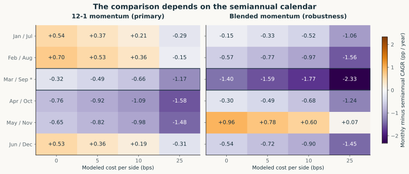

# Rebalance Lab: A Validation Study of Momentum Rebalancing

**The sign of the monthly-minus-semiannual performance difference changes across six rebalancing calendars.** In the 2001-2025 sector-ETF study, the 12-1 comparison at 5 bps per side ranges from **-0.92 to +0.53 percentage points of CAGR per year**. The designated March/September comparison is **-0.49 pp/year**.



*Monthly minus semiannual CAGR; positive favors monthly. The outlined March/September row is the designated reference. Both signals and every calendar/cost cell are reported.*

[Research site](https://yuchi-wang02.github.io/rebalance-lab/) · [Four-page validation brief](site/assets/rebalance-lab-validation-brief.pdf) · [One-page validation memo](site/assets/rebalance-lab-validation-memo.pdf) · [Executed notebook](notebooks/validation-study.ipynb)

## What this repository demonstrates

- Rules fixed before the extension runs, with prior exposure to the history disclosed.
- Signals formed at the close, with execution at the next exchange-session open.
- Separate self-financing accounts for 0, 5, 10 and 25 bps per executed side.
- All six semiannual phases reported, without choosing the best observed calendar.
- A second accounting implementation and a separate tranche/statistical reconciliation.

## Test the mitigation, then qualify the conclusion

Six semiannual sleeves receive one-sixth of initial capital and subsequently run without transfers or trade netting. This pooled portfolio returns **8.24% CAGR**, compared with **8.02%** for monthly and **8.51%** for March/September. Its **-40.91%** maximum drawdown is deeper than both primary alternatives.

| Monthly minus | CAGR difference, pp/year | Paired 95% interval |
|---|---:|---:|
| March / September | -0.49 | [-3.03, +2.11] |
| Six-sleeve tranche | -0.22 | [-2.44, +2.33] |

Intervals use 10,000 paired stationary bootstrap draws of 300 net monthly returns, with mean block length 12 months. Both include zero. The observed primary monthly disadvantage does not establish a general frequency ranking. The tranche diversifies the calendar allocation; this sample does not show that it eliminates risk or timing dependence.

## Read the evidence

| Material | Purpose |
|---|---|
| [Research report](docs/studies/validation-study.md) | Findings, risk, uncertainty and the A/B/C appendix |
| [Method protocol](docs/methods/validation-study.md) | Exact portfolio, tranche and inference rules |
| [Validation memo](docs/validation/validation-memo.md) | Scope, lineage, replication, judgment and residual risk |
| [Design decisions](docs/methods/design-decisions.md) | Five technical choices and their alternatives |
| [Reproduction guide](docs/reproduction.md) | Public-input analysis and private-snapshot engine replay |

The [stock pilot](docs/archive/studies/stock-pilot.md) is a companion case. The [original 75-stock protocol](docs/archive/methods/original-stock-protocol.md) is archived as incomplete research history after its data requirements could not be met.

## Reproduce locally

```bash
python -m venv .venv
.venv/Scripts/python -m pip install -r requirements-research.txt
.venv/Scripts/python scripts/validate_validation_artifacts.py
.venv/Scripts/python -m unittest discover -s tests -p 'test_*.py'
.venv/Scripts/python -m http.server 8000 --directory site
```

The example uses Windows paths. On macOS/Linux replace `.venv/Scripts/python` with `.venv/bin/python`. Full commands and input requirements are in the reproduction guide. No network request or credential is required for the public companion notebook.

## Evaluation focus and owner contribution

The project connects accounting and control habits with Business Analytics and AI: define the measurement, reconcile the account, inspect exceptions and state what the evidence supports. It is a financial case for model-validation and AI-evaluation readers.

The owner selected the audience, financial scope and validation focus; personally reconciled one historical trade using Python; and reviewed the calendar, uncertainty and evidence-boundary interpretations in writing. AI assisted the implementation, numerical checks and drafting. The exact signal-window explanation and an observed timed presentation remain pending; full owner reproduction of the notebook has not been verified. See the [dated contribution record](results/owner-review-progress.json).

## Limitations

This is a retrospective nine-sector-ETF study using vendor-adjusted price and next-open execution proxies, zero-interest cash and fixed modeled costs. Sector definitions changed over time. Bootstrap intervals are conditional on the observed history and resampling assumptions. Separate implementations reconcile arithmetic on the same inputs; the same AI agent authored them, so they do not establish independent reviewer agreement, source-price accuracy or achievable execution. Original code and documentation use the MIT license; raw vendor exports remain excluded.
