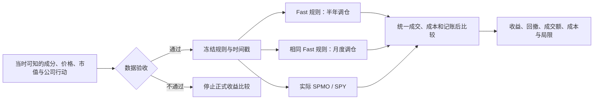

# SPMO Fast Lab

**保留 SPMO 风格，更频繁地换仓，是否值得付出额外交易成本？**

这是一个自定义动量组合的研究项目，第一步聚焦 2026 年的探索性实验。它不是已发行 ETF，也不代表 Invesco 或 S&P Dow Jones Indices 的官方产品。

> **当前状态：实验设计 v0.1。没有真实市场回测结果，也没有已验证的策略收益。**
> 本仓库提供研究方案、数据验收要求和机器可读配置；回测引擎、行情接入和结果图表尚未实现。配置检查通过不等于策略有效。

## 要回答的问题

1. **频率有没有价值？** 对完全相同的 Fast 规则，只把半年调仓改为月度，比较扣费后的结果。
2. **整体方案是否有竞争力？** 将月度 Fast 与实际 SPMO、SPY 在相同可成交起点下比较。
3. **改动分别贡献什么？** 分步加入多周期信号、持股数与缓冲、平方根市值权重、入场趋势过滤。周度风控留到第二阶段。

“更快发现赢家”“更早退出旧趋势”是待检验假设。频率提高也可能带来更多噪声交易、成本和反转损失。

## 实验结构



| 项目 | 本版建议默认值 |
|---|---|
| 探索窗口 | 2025-12-31 收盘至 2026-10-02 收盘；保留此前讨论的截止日 |
| 初始资金 | 所有可交易比较组合均从现金开始，2026 年首个交易日开盘建仓 |
| 股票池 | 当时有效且当时可知的 S&P 500 成分证券，不能用今天的名单回填 |
| Fast 信号 | 12–1 / 6–1 / 3–1 交易月风险调整动量，50% / 30% / 20% |
| 选股与权重 | 目标 75 只，明确的 60/100 缓冲规则；正动量分数 × 历史市值平方根 |
| 仓位限制 | 调仓目标单证券上限 8%；漂移期间不自动触发日内交易 |
| 成交 | 月末收盘生成信号，下一交易日开盘执行；不以同一收盘价成交 |
| 成本 | 买卖各 5 bps；另看 0 / 10 / 25 bps 单边成本情景 |
| 主指标 | 净总回报差，单位为百分点；风险与成交额同时披露 |

这些参数是**研究建议**，不是用户已经选定的最优参数，也不是官方 SPMO 规则。完整定义见[实验设计](docs/experiment-design.md)。所有组合的交易成本都计入首次建仓；期末按市值计价，不假装完成清算。标准 ETF 年末收盘到截止日收盘的 YTD 另列参考，不与首日开盘建仓的策略混作公平主比较。

## 可行性判断

**研究工程可以推进；严谨回测的关键前提是历史数据。** 日频、数百只证券的规则策略适合普通 Python 开发环境。当前尚未做性能基准，不能把工程判断当作实测运行结果。

历史成分、当时可知的市值、退市与公司行动缺一不可。当前成分 + 免费行情可以帮助调试，但不能悄悄升级为无幸存者偏差的正式结论。2026 年行情已经影响了策略构思，因此这段回测是探索性的，不能称为真正未见过的样本外证据。

详见[数据要求与可行性](docs/feasibility.md)、[证据与来源边界](docs/evidence.md)。

## 仓库导航

| 文件 | 用途 |
|---|---|
| [实验设计](docs/experiment-design.md) | 对照组、规则、指标、决策标准及统计限制 |
| [可行性与数据契约](docs/feasibility.md) | 数据门槛、工程阶段与验收条件 |
| [证据说明](docs/evidence.md) | 哪些内容已读取、哪些尚未核实 |
| [实验配置](configs/experiment.v1.json) | 版本化候选规则、比较关系、成本情景 |
| [状态文件](results/status.json) | 明确标记尚无市场回测结果 |
| [配置检查器](scripts/validate_design.py) | 检查控制组只改变频率、信号权重、时间和本地文档链接 |

## 本地检查

需要 Python 3.12 或更高版本，无第三方依赖：

```bash
cd /workspace/SPMO-ETF-test
python3 scripts/validate_design.py
```

其他机器在克隆后的仓库根目录运行第二行即可。这个命令只验证**研究配置与文档一致性的有限检查项**，不会下载行情、运行回测或生成收益。云任务使用已有 checkout，无需额外创建 Git worktree。

## 下一步与结果发布门槛

- [x] 阅读原始讨论，明确研究目标及既有结果缺口。
- [x] 写出候选规则、频率对照、消融方案和数据要求。
- [ ] 获取有来源与时间戳的历史数据，完成覆盖和公司行动审计。
- [ ] 实现回测引擎，验证成交延迟、现金、分红、拆分、退市和费用记账。
- [ ] 冻结代码、配置和数据版本，执行真实市场实验。
- [ ] 发布由代码生成的净值曲线、月度收益、交易记录和全部预设比较。
- [ ] 从规则冻结后的首个可用交易日起记录前瞻模拟；不能回填成实时记录。

结果必须包含代码提交号、配置哈希、数据清单、明确的价格/总回报口径和失败记录。没有完成数据验收的数字不进入正式排名。原始聊天、凭据和未经许可的市场数据不放入仓库。
