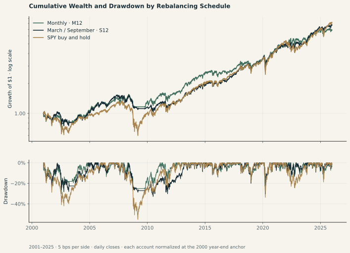
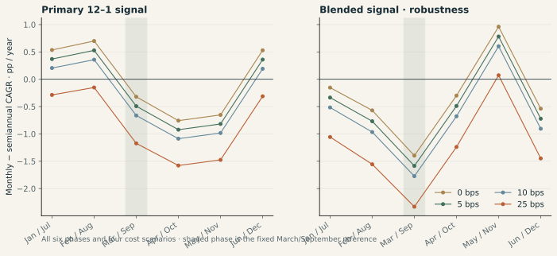
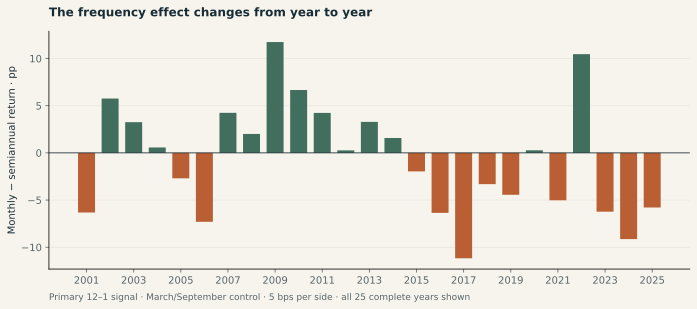

# What happened when we rebalanced momentum more often?

**In this separate sector-ETF pilot, monthly rebalancing did not improve the primary long-run return comparison.** Over 2001–2025 at 5 basis points per side, monthly 12–1 momentum earned **8.02% CAGR**, versus **8.51%** for the fixed March/September schedule. Monthly had a shallower maximum drawdown, but traded substantially more. The answer is a return/risk/trading tradeoff, not a general recommendation to use one frequency.

This is a completed run on historical market prices under an adjusted-price proxy. **It is not completion of the original top-75 stock experiment.** That experiment still lacks accepted historical membership, class capitalization and event data; the [original data audit](../data/original-data-audit.md) documents the evidence and unresolved inputs.

## The experiment we actually ran

The [pilot protocol](../methods/sector-etf-protocol.md) and [configuration](../../configs/sector-etf-pilot.v1.json) were frozen in commit [`8bb2e11`](https://github.com/Yuchi-Wang02/rebalance-lab/commit/8bb2e11) before calculating this pilot's performance. The research question and historical window were chosen retrospectively. Freezing the implementation does **not** make the results out of sample or prospectively preregistered.

The investable set is the original nine Select Sector SPDR funds: XLB, XLE, XLF, XLI, XLK, XLP, XLU, XLV and XLY. At each signal date, rank positive risk-adjusted momentum scores and select at most three funds, allocating one-third of post-fee value to each. Unfilled slots stay in zero-interest cash. Monthly and semiannual arms use the same selection, weights and execution rule; frequency is the changed treatment within each signal pair. The primary signal is 252-session momentum skipping the latest 21 sessions; the blended check combines 252/126/63-session scores at 50/30/20 weights.

Signals use month-end closes and trades use the next verified session's opening proxy. Accounts start trading in January 2000, use 2000 as burn-in and continue without liquidation or annual resets. Full-period returns are measured from the **December 29, 2000 close through December 31, 2025**, covering 25 complete calendar years. The 2026 partial year is separate.

There are **56 strategy paths**: eight monthly controls reused across comparisons, plus 48 semiannual paths covering two signals, six fixed calendar phases and four cost assumptions. Four SPY paths provide context. This yields 48 paired full-period comparisons, not 48 independent experiments.

## Primary result: less trading earned more, with a drawdown tradeoff

All figures below use **5 bps per executed side**. CAGR annualizes the 25-year growth factor. Total return is cumulative; maximum drawdown uses daily closing valuations, including the reporting anchor. “Annual turnover” is total **buy plus sell** notional divided by each trade's pretrade portfolio value, then divided by 25; it is not halved. Average cash is the average daily portfolio cash weight.

| Strategy | Net CAGR | Total return | Maximum drawdown | Annual two-sided turnover | Average cash |
|---|---:|---:|---:|---:|---:|
| M12: monthly, 12–1 | 8.02% | 587.36% | -30.32% | 504.10% | 8.25% |
| S12: March/September, 12–1 | 8.51% | 670.10% | -32.81% | 185.98% | 8.08% |
| MMIX: monthly, blended | 7.29% | 480.44% | -32.39% | 548.79% | 7.69% |
| SMIX: March/September, blended | 8.87% | 737.53% | -30.34% | 195.30% | 6.75% |
| SPY: buy and hold | 8.76% | 716.58% | -55.19% | 0.00% | 0.00% |

The primary monthly-minus-semiannual CAGR difference is **−0.49 percentage points**; the cumulative-return difference is **−82.74 points**. Monthly's maximum drawdown is 2.49 points shallower. It nevertheless requires about **2.71 times** the trading activity, with almost the same average cash allocation. These comparisons do not establish why particular market episodes favored a schedule.

SPY had greater long-run growth than either primary arm and a substantially deeper drawdown in this sample. It is a useful opportunity-cost reference, not a control isolating frequency: it holds different exposures and stays invested. Its reported turnover is zero during 2001–2025 because the benchmark was purchased before the reporting anchor; its initialization was not silently charged again. Embedded fund expenses are not subtracted twice.

## Costs strengthen the case against a blanket “faster is better” claim

Each cost setting is a separate self-financing simulation: fees and post-fee target holdings are solved together. The figures below are net CAGRs for the fixed **March/September** comparison; the blended signal is a within-study robustness check using the same market history.

| Cost per side, bps | M12 | S12 | MMIX | SMIX |
|---:|---:|---:|---:|---:|
| 0 | 8.29% | 8.61% | 7.58% | 8.98% |
| 5 | 8.02% | 8.51% | 7.29% | 8.87% |
| 10 | 7.74% | 8.41% | 6.99% | 8.77% |
| 25 | 6.93% | 8.10% | 6.12% | 8.45% |

The monthly primary arm trails its fixed semiannual comparator even at zero modeled trading cost. Increasing cost widens that gap. The blended monthly arm also trails its March/September comparator at every tested cost. Therefore neither adding the shorter momentum horizons nor assuming free trading rescues the proposed universal frequency advantage in this pilot. The grid does not identify an exact break-even cost, and no break-even value is inferred by linearly subtracting fees from one gross path.

## Calendar sensitivity: report every phase, keep the primary phase fixed

The table reports **monthly minus semiannual CAGR, in percentage points**. Positive values favor monthly; negative values favor the listed semiannual phase. March/September remains the primary comparison regardless of another phase's result.

| Signal | Semiannual signal months | 0 bps | 5 bps | 10 bps | 25 bps |
|---|---|---:|---:|---:|---:|
| 12–1 | Jan/Jul | +0.54 | +0.37 | +0.21 | −0.29 |
| 12–1 | Feb/Aug | +0.70 | +0.53 | +0.36 | −0.15 |
| 12–1 | **Mar/Sep (primary)** | −0.32 | −0.49 | −0.66 | −1.17 |
| 12–1 | Apr/Oct | −0.76 | −0.92 | −1.09 | −1.58 |
| 12–1 | May/Nov | −0.65 | −0.82 | −0.98 | −1.48 |
| 12–1 | Jun/Dec | +0.53 | +0.36 | +0.19 | −0.31 |
| Blended | Jan/Jul | −0.15 | −0.33 | −0.52 | −1.06 |
| Blended | Feb/Aug | −0.57 | −0.77 | −0.97 | −1.56 |
| Blended | **Mar/Sep (primary)** | −1.40 | −1.59 | −1.77 | −2.33 |
| Blended | Apr/Oct | −0.30 | −0.49 | −0.68 | −1.24 |
| Blended | May/Nov | +0.96 | +0.78 | +0.60 | +0.07 |
| Blended | Jun/Dec | −0.54 | −0.72 | −0.90 | −1.45 |

At 5 bps, monthly 12–1 beats **three of six** phases and loses to three. Its comparison changes sign when only the semiannual calendar changes. At 25 bps it loses to all six. The blended monthly arm beats only **one of six** phases at each tested cost. These are overlapping schedules on the same securities and dates, with shared monthly controls. They cannot be counted as independent confirmations, and the most favorable observed schedule is not promoted as a new strategy.

## Annual outcomes: a small majority of wins did not compound into a win

Monthly 12–1 beats the primary March/September arm in **13 of 25** full calendar years, loses in **12**, and ties in none. Despite that small majority, its 25-year compounded return is lower. Win counts ignore the size and sequence of gains and losses; they are not a profitability test.

All 25 annual primary outcomes and all other signal/phase/cost combinations are in the [annual comparison CSV](../../site/data/etf-pilot-annual.csv). Annual boundaries measure returns on continuing accounts; they do not reset positions. Adjacent annual returns and overlapping momentum windows remain dependent. No binomial test, p-value or independent-replication claim is made from this count.

## The separate 2026 case points in a different direction

From the **December 31, 2025 close through October 2, 2026**, the primary monthly arm leads by **12.99 percentage points**. These are partial-year returns, **not annualized**; they do not replace the full-period result.

| Strategy, 5 bps per side | 2026 return through October 2 | Maximum drawdown | Period two-sided turnover |
|---|---:|---:|---:|
| M12 | 22.28% | -7.81% | 372.92% |
| S12: March/September | 9.29% | -10.22% | 266.62% |
| MMIX | -1.32% | -9.56% | 560.34% |
| SMIX: March/September | -1.31% | -10.12% | 266.62% |
| SPY: buy and hold | 13.75% | -8.88% | 0.00% |

The striking difference between the 12–1 and blended monthly outcomes in this same partial year is another reason to avoid a frequency-only story. The short window cannot establish durable superiority or support causal claims about a market regime. All phases and cost cases remain available in the [2026 CSV](../../site/data/etf-pilot-ytd2026.csv).

## What worked, what failed, and what this does not answer

The useful result is that the question now has a measured answer for a clearly bounded, executable proxy: more frequent trading changes both returns and risk, and the calendar can change the sign of the comparison. Publishing the full cost and phase grid prevented a favorable partial-year result from becoming the sole headline. The unqualified hypothesis that monthly selection improves long-run net returns **failed in the designated primary comparison**.

The attempted direct route to the original stock study also failed its data gate. Public membership snapshots and current share counts cannot safely stand in for historical security-level inputs. That remains an acquisition and accounting problem, not a result about the original strategy. This pilot uses equal one-third ETF slots and dividend-adjusted signals; it does not test the original top-75 selection, class-cap weighting, dividend-excluding signal or pay-date cash ledger. It also does not directly test SPMO replication.

The price model is a material limitation. Yahoo adjusted closes are a **vendor total-return proxy**; opening prices are multiplied by the same day's `AdjClose / Close` factor. Adjusted units are not raw shares. Dividends are not independently booked or reinvested on verified payment dates. ETF holdings and sector definitions changed during the history, including the 2016 real-estate and 2018 communication-services reorganizations. A targeted inspection of XLF's 2016 distribution found a continuous adjusted-price path, while Yahoo encoded the event as a split. That check does not turn the vendor convention into an independently reconciled raw-share event ledger.

The acquisition audit found a common 6,987-session history from December 22, 1998 through October 2, 2026, with no missing required common sessions or incomplete OHLC rows in the captured responses. These checks establish structural coverage. They do not establish a second-source total-return match, attainable opening fills, market impact, capacity, taxes or investor-specific after-tax returns. Transaction costs here are explicit scenarios, not validated all-in execution estimates. No result in this report is a forecast.

A separate accounting implementation reproduced all 60 paths, covering 56 strategy runs and four benchmark runs, within floating-point tolerance. This provides evidence for the simulation's arithmetic and timing under the supplied prices. It does not independently validate the market prices or adjustment factors.

A stronger follow-up would first reconcile corporate-action adjustments with independent fund records, then test a newly frozen protocol on genuinely unseen observations or a separately justified sample. Any such extension must preserve this published baseline and report its changed assumptions. Completing the original stock study additionally requires the dataset and event-ledger work listed in the [source audit](../data/original-data-audit.md).

## Inspect the evidence

- [Machine-readable summary, audits and input/code hashes](../../site/data/etf-pilot-summary.json): run `20261009T021722928426Z-9e9cb830b3cb`; flags explicitly separate the executed market pilot from the uncompleted original experiment.
- [All 48 full-period paired comparisons](../../site/data/etf-pilot-full_period.csv).
- [All 1,200 annual comparisons](../../site/data/etf-pilot-annual.csv): 48 pairs × 25 complete years.
- [All 48 separate 2026 comparisons](../../site/data/etf-pilot-ytd2026.csv).
- [Protocol](../methods/sector-etf-protocol.md), [configuration](../../configs/sector-etf-pilot.v1.json), [run script](../../scripts/run_etf_pilot.py) and [data acquisition/audit script](../../scripts/etf_pilot_data.py).

The published statistics were checked against the summary's paired differences and annual records. Input hashes identify the captured snapshot; a later vendor download may differ because adjusted histories can be revised. Raw source responses and detailed private ledgers are not redistributed with these summary outputs.
