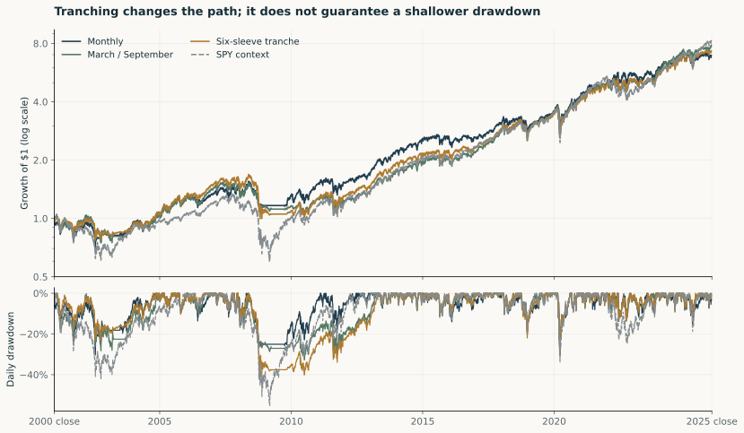
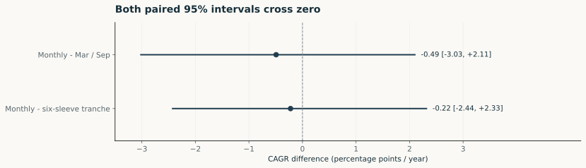
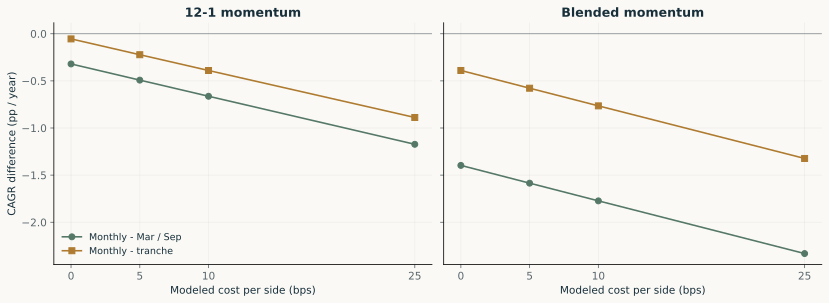

# A validation study of momentum rebalancing

*Research version 1 - 9 October 2026. Retrospective study; primary window 2001-2025.*

## Question and judgment

Does more frequent selection and reweighting improve this long-only momentum portfolio? The designated monthly-minus-March/September CAGR difference is -0.49 pp/year, but its sign changes across the six semiannual schedules. The primary paired interval crosses zero. The evidence supports calendar sensitivity in this sample; it does not support an optimal frequency or a general causal explanation based on timing luck.

## Calendar and cost sensitivity

For 12-1 at 5 bps, monthly wins against three phases and loses against three. Differences range from -0.92 to +0.53 pp/year. At 25 bps, it trails all six. The blended recipe is a robustness check on the same history, not independent replication. Six phases share the monthly control, assets and dates. Calendar dispersion is a scenario range, not a confidence interval.

## A calendar-diversified comparison

The tranche holds six autonomous semiannual sleeves. All receive equal initial capital before the 3 January 2000 first execution. Sleeve capital then drifts; the 2000 year-end reporting anchor only normalizes the pooled NAV. There are no sleeve transfers, daily re-equalization, additional signal rules or cross-sleeve order netting. Cash, units, NAV, gross trading and fees are scaled and summed from the existing accounts.

| Portfolio | Net CAGR | Daily max drawdown | Sharpe | Tracking error | SPY beta | Traded NAV / year |
|---|---:|---:|---:|---:|---:|---:|
| Monthly | 8.02% | -30.32% | 0.519 | 9.97% | 0.671 | 5.04x |
| March / September | 8.51% | -32.81% | 0.557 | 8.68% | 0.718 | 1.86x |
| Six-sleeve tranche | 8.24% | -40.91% | 0.541 | 7.96% | 0.740 | 1.93x |
| SPY context | 8.76% | -55.19% | 0.522 | 0.00% | 1.000 | 0.00x |

*5 bps per side. Sharpe, tracking error and beta use 300 monthly simple returns; tracking error and beta reference SPY. Cash earns zero even though RF is subtracted when evaluating excess return. Drawdown uses daily closes. Trading is gross buys plus sells, without halving. SPY is opportunity-cost context with different exposures, not a matched frequency control.*

The tranche's observed CAGR lies between the primary alternatives. Its maximum drawdown is -40.91%, compared with -30.32% monthly and -32.81% for March/September. Pooling calendars is not a guarantee of better growth or a shallower drawdown.

## Uncertainty

| Monthly minus | CAGR difference, pp/year | Paired 95% interval |
|---|---:|---:|
| March / September | -0.49 | [-3.03, +2.11] |
| Six-sleeve tranche | -0.22 | [-2.44, +2.33] |

These are percentile intervals for a difference of compounded annual growth rates. The same monthly index sequence is sampled for all accounts, preserving their contemporaneous dependence. There are 10,000 draws; primary expected block length is 12 months, with 6 and 24 months reported below. Both primary intervals include zero. That is evidence of uncertainty, not proof that the policies are equivalent.

| Mean block, months | Monthly - Mar/Sep, 95% CI | Monthly - tranche, 95% CI |
|---:|---:|---:|
| 6 | [-2.91, +1.96] | [-2.36, +2.18] |
| 12 | [-3.03, +2.11] | [-2.44, +2.33] |
| 24 | [-3.20, +2.18] | [-2.43, +2.38] |

The bootstrap resamples realized net portfolio returns; it does not replay selection on synthetic price histories. Its assumptions, nonstationarity and retrospective choices remain sources of risk. No best calendar or cost is selected from the grid.

## Appendix: selection updates and weight resets

A refreshes selection and weights semiannually. B retains A's selected names and cash slots but resets weights monthly. C refreshes both monthly. At the primary signal, phase and cost, A/B/C CAGR is **8.51% / 8.63% / 8.02%**. B-A is +0.12 pp/year and C-B is -0.61 pp/year. These are sequential conditional comparisons, not a unique causal allocation of performance. The three mean-log-return HAC comparisons use 12 lags and Holm adjustment within that appendix family; their intervals and exact units are in the saved summary.

## Secondary 2026 case

Through 2 October 2026, monthly returns 22.28%, March/September 9.29%, and the tranche 16.70%. These continuous-account partial-year returns are not annualized and are excluded from primary inference.

## Evidence and limits

The legacy ETF replay checks 60 accounts. The mechanism replay checks 108 accounts and 726,732 daily states. The extension reconciliation checks eight pooled paths, 53,832 daily states, 34,800 monthly rows and risk/bootstrap calculations. These checks address implementation consistency on a preserved snapshot. Same-agent authorship, vendor-price proxies, changing fund sectors, fixed costs, zero-interest cash, and nonstationarity remain limitations. See the [validation memo](../validation/validation-memo.md) and [reproduction guide](../reproduction.md).
